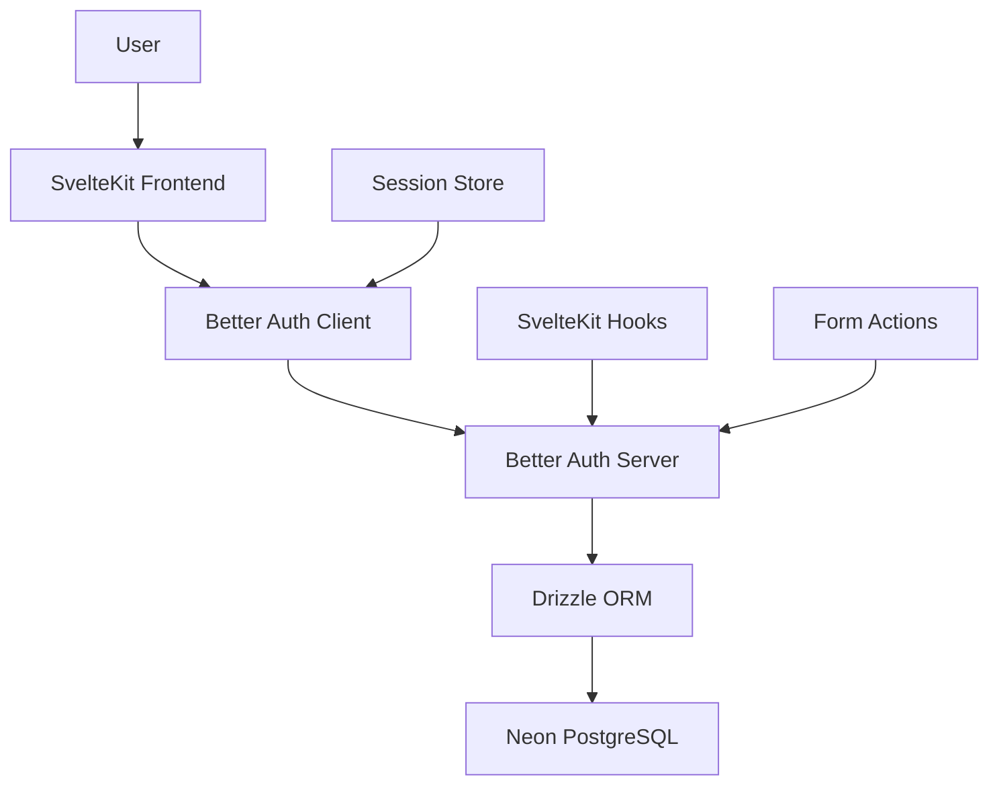
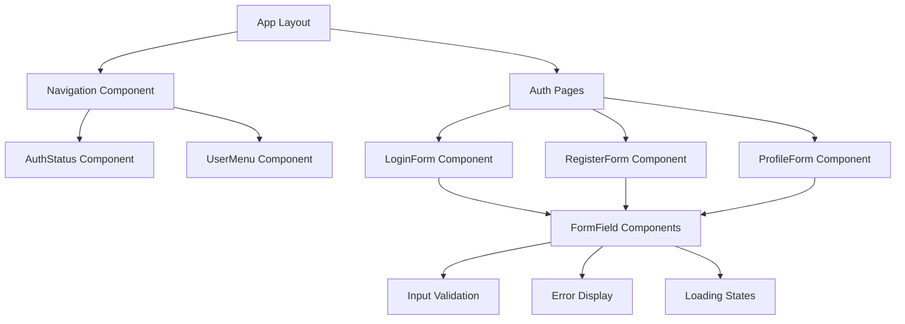
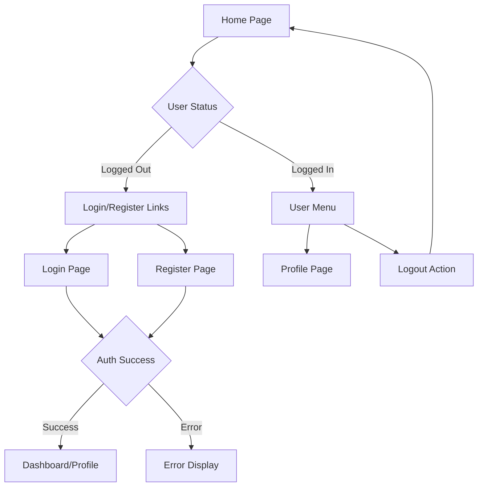

# Design Document

## Overview

This design implements a comprehensive user authentication system for the National Park Planner using Better Auth with email/password authentication. The system provides secure user registration, login, logout, and profile management through a modern, responsive interface built with Flowbite-Svelte components and SvelteKit's server-side capabilities.

The design leverages the existing Better Auth configuration and database schema while adding complete user interface components, form validation, session management, and error handling to create a seamless authentication experience.

## Architecture

### Authentication Flow Architecture



### Component Architecture



### Session Management Architecture

- **Client-side**: Better Auth Svelte client with reactive session store
- **Server-side**: SvelteKit hooks for session validation and route protection
- **Persistence**: Secure HTTP-only cookies with configurable expiration
- **State Management**: Reactive Svelte stores for real-time UI updates

## Components and Interfaces

### Core Authentication Components

#### 1. AuthForm Component

**Purpose**: Reusable form wrapper with validation and error handling
**Props**:

- `title: string` - Form title
- `submitText: string` - Submit button text
- `isLoading: boolean` - Loading state
- `errors: Record<string, string>` - Field-specific errors

#### 2. FormField Component

**Purpose**: Standardized form input with validation feedback
**Props**:

- `label: string` - Field label
- `type: 'email' | 'password' | 'text'` - Input type
- `placeholder: string` - Placeholder text
- `required: boolean` - Required field indicator
- `error?: string` - Validation error message
- `value: string` - Bound value

#### 3. AuthStatus Component

**Purpose**: Displays current authentication state in navigation
**Features**:

- Shows login/register links when logged out
- Shows user menu with profile/logout when logged in
- Reactive to session changes

#### 4. UserMenu Component

**Purpose**: Dropdown menu for authenticated users
**Features**:

- User name/email display
- Profile link
- Logout functionality
- Responsive design

### Page Components

#### 1. Login Page (`/auth/login`)

**Features**:

- Email and password form using Flowbite Input components
- Form validation with real-time feedback
- Loading states during authentication
- Error message display
- Link to registration page
- Remember me checkbox

#### 2. Registration Page (`/auth/register`)

**Features**:

- Email, password, confirm password, and name fields
- Password strength validation
- Password confirmation matching
- Email format validation
- Success redirect to dashboard
- Link to login page

#### 3. Profile Page (`/profile`)

**Features**:

- Display current user information
- Editable name field
- Email display (read-only with change option)
- Account creation date
- Profile update form with validation

### Form Validation System

#### Client-side Validation

```typescript
interface ValidationRules {
  email: {
    required: true;
    pattern: /^[^\s@]+@[^\s@]+\.[^\s@]+$/;
    message: "Please enter a valid email address";
  };
  password: {
    required: true;
    minLength: 8;
    pattern: /^(?=.*[A-Za-z])(?=.*\d)/;
    message: "Password must be at least 8 characters with letters and numbers";
  };
  name: {
    required: true;
    minLength: 2;
    message: "Name must be at least 2 characters";
  };
}
```

#### Server-side Validation

- Better Auth built-in validation for email/password
- Custom validation for additional fields
- Sanitization of user input
- Rate limiting for auth attempts

## Data Models

### User Session Interface

```typescript
interface UserSession {
	user: {
		id: string;
		name: string;
		email: string;
		emailVerified: boolean;
		image?: string;
		createdAt: Date;
		updatedAt: Date;
	};
	session: {
		id: string;
		expiresAt: Date;
		token: string;
		ipAddress?: string;
		userAgent?: string;
	};
}
```

### Form State Management

```typescript
interface AuthFormState {
	values: Record<string, string>;
	errors: Record<string, string>;
	touched: Record<string, boolean>;
	isSubmitting: boolean;
	isValid: boolean;
}
```

## Error Handling

### Error Categories

#### 1. Validation Errors

- **Client-side**: Real-time field validation with immediate feedback
- **Server-side**: Form submission validation with field-specific errors
- **Display**: Red border on invalid fields, helper text with error messages

#### 2. Authentication Errors

- **Invalid credentials**: "Invalid email or password" message
- **Email already exists**: "Email already registered" with login link
- **Network errors**: "Connection failed, please try again" with retry option
- **Server errors**: Generic "Something went wrong" message with support contact

#### 3. Session Errors

- **Expired session**: Automatic redirect to login with return URL
- **Invalid session**: Clear session data and redirect to home
- **Concurrent sessions**: Allow multiple sessions per user

### Error Display Strategy

- **Toast notifications** for temporary errors (network, server)
- **Inline form errors** for validation issues
- **Page-level errors** for critical failures
- **Loading states** to prevent user confusion during operations

## Testing Strategy

### Unit Testing

- **Form validation logic**: Test all validation rules and edge cases
- **Component rendering**: Test component props and state changes
- **Error handling**: Test error display and recovery scenarios
- **Session management**: Test session creation, validation, and cleanup

### Integration Testing

- **Authentication flows**: Test complete login/register/logout flows
- **Form submissions**: Test form data handling and server responses
- **Route protection**: Test protected route access and redirects
- **Session persistence**: Test session survival across browser restarts

### End-to-End Testing

- **User registration flow**: Complete new user signup process
- **User login flow**: Existing user authentication process
- **Profile management**: User profile viewing and editing
- **Session management**: Login persistence and logout functionality

### Security Testing

- **Password hashing**: Verify secure password storage
- **Session security**: Test session token security and expiration
- **Input sanitization**: Test XSS and injection prevention
- **Rate limiting**: Test authentication attempt limits

## User Experience Design

### Visual Design Principles

- **Consistency**: Use Flowbite-Svelte components for uniform appearance
- **Accessibility**: Proper labels, ARIA attributes, keyboard navigation
- **Responsiveness**: Mobile-first design with responsive breakpoints
- **Loading states**: Clear feedback during async operations

### Navigation Flow



### Form UX Patterns

- **Progressive disclosure**: Show password requirements on focus
- **Real-time validation**: Immediate feedback on field blur
- **Clear error recovery**: Specific error messages with correction guidance
- **Optimistic UI**: Immediate feedback with server confirmation

### Mobile Considerations

- **Touch-friendly**: Adequate button sizes and spacing
- **Keyboard handling**: Proper input types for mobile keyboards
- **Viewport optimization**: Responsive forms that fit mobile screens
- **Performance**: Minimal JavaScript for fast mobile loading
